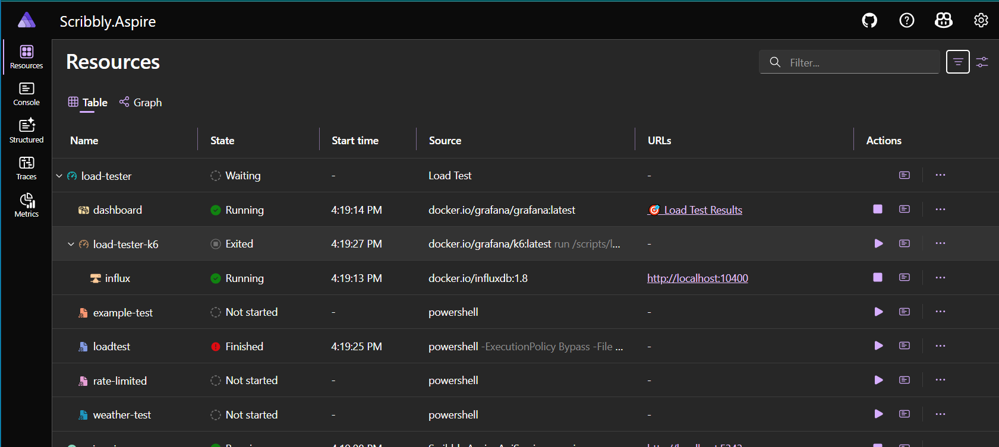
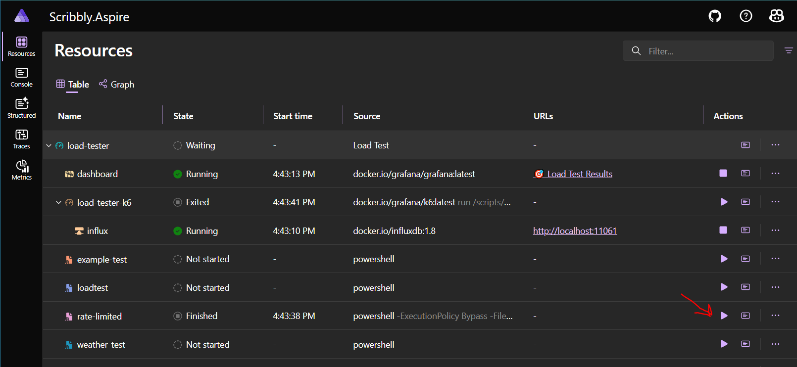
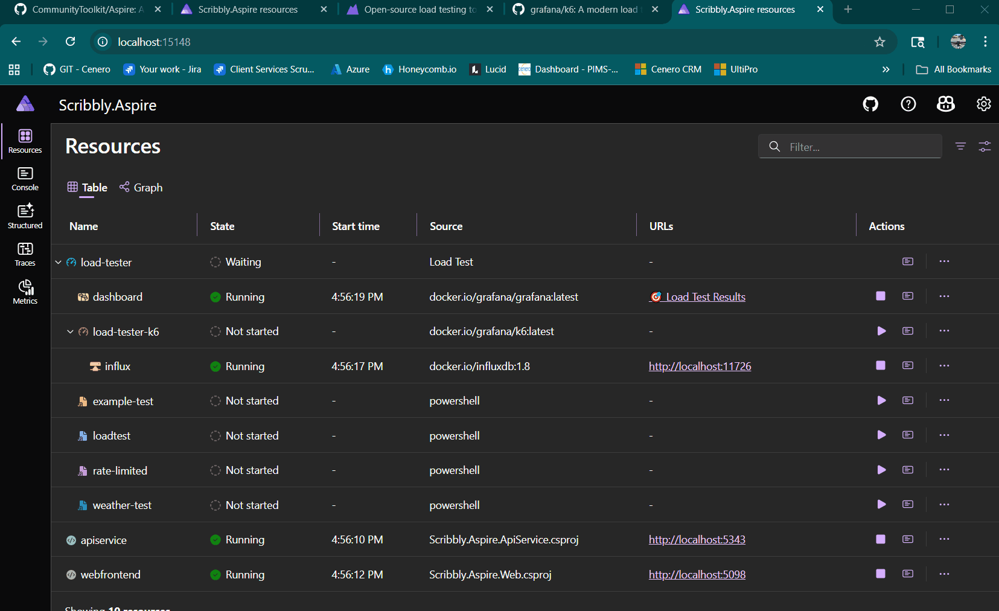
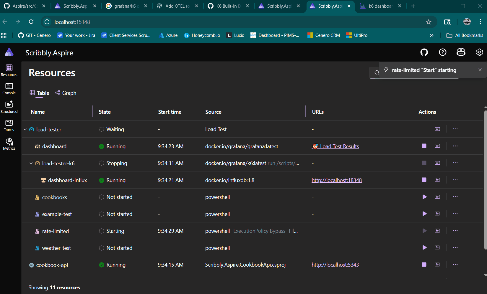
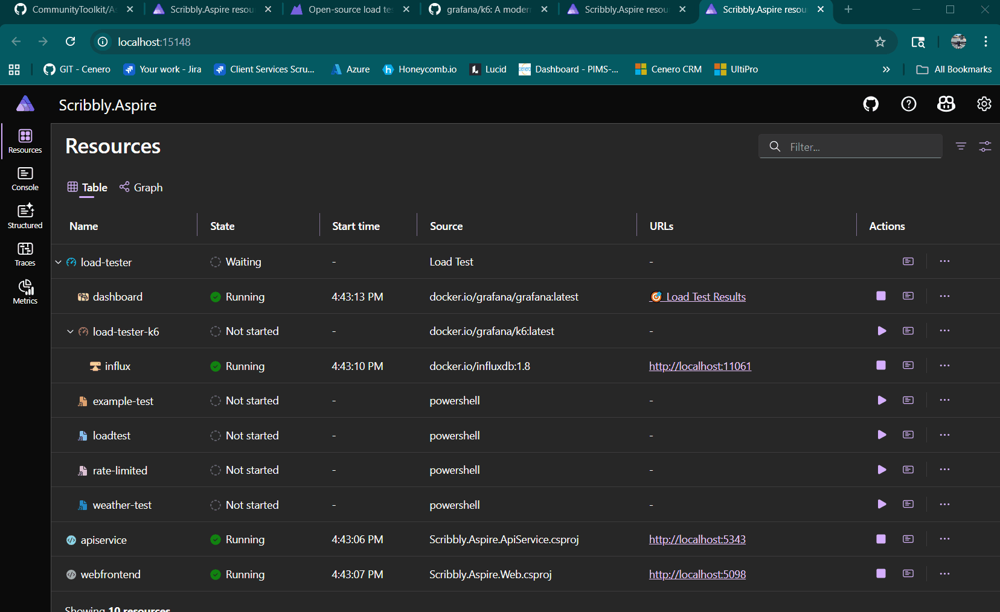

# Scribbly.Aspire.Hosting.LoadTesting

The ``Scribbly`` load testing resource is a Dotnet Aspire resource that integrates with `K6` and `Grafana`

The `Scribbly.Aspire.Hosting.LoadTest` resource can be used to run K6™ load tests and output the data to a realtime grafana™ dashboard.
This resource can be configured at runtime, used to generate load test scripts from C# and discovery scripts from a provided directory.

https://k6.io/

<!-- TOC -->
* [Scribbly.Aspire.Hosting.LoadTesting](#scribblyaspirehostingloadtesting)
* [Load Test Resource](#load-test-resource)
* [Script Resource](#script-resource)
* [Dashboard Resource](#dashboard-resource)
<!-- TOC -->

# Load Test Resource

The main load test resource is used to monitor the K6 container and logically group all related resources.



> [!Warning]
> Note as of now the root resource is not monitoring the status of the k6 resource.  This will be updated at later date.

To start using the load test resource with the ``AddLoadTesting`` distributed application extension method.

```csharp
var builder = DistributedApplication.CreateBuilder(args);

if (!builder.ExecutionContext.IsPublishMode)
{
    builder.AddLoadTesting("load-tester", "./scripts");
}

builder.Build().Run();
```

The `AddLoadTesting` method accepts two parameters, the resource name and a directory containing k6 `.js` files.
The `Scribbly.Aspire.Hosting.LoadTesting` includes several embedded resource including an example script.  If the provided 
directory contains no .js files the example test script will be copied to this directory.

This Aspire resource assumes your script uses the environment variable ``ASPIRE_RESOURCE`` as the base URL.  This allows Aspire to 
inject endpoint resources into the script.

```javascript
import http from 'k6/http';
import { sleep } from 'k6';

const ASPIRE_RESOURCE = __ENV.ASPIRE_RESOURCE || 'http://localhost:8080';

export let options = {
  vus: 10,
  duration: '30s',
};

export default function () {
  http.get(`${ASPIRE_RESOURCE}/weatherforecast`);
  sleep(1);
}
```
The scripts can then be bound to an endpoint resource.  Use the `WithDefaultApiResourceForScripts` method to provide an API resource used for all scripts.

```csharp
var builder = DistributedApplication.CreateBuilder(args);

var apiService = builder.AddProject<Projects.Scribbly_Aspire_ApiService>("weather-api");

if (!builder.ExecutionContext.IsPublishMode)
{
    builder
        .AddLoadTesting("load-tester", "./scripts")
        .WithDefaultApiResourceForScripts(cookbookApi);
}

builder.Build().Run();
```
Individual scripts can override the default binding.

```csharp
var builder = DistributedApplication.CreateBuilder(args);

var apiService = builder.AddProject<Projects.Scribbly_Aspire_ApiService>("weather-api");

if (!builder.ExecutionContext.IsPublishMode)
{
    builder
        .AddLoadTesting("load-tester", "./scripts")
        .WithApiResourceForScript("weather-test", weatherApi)
        .WithDefaultApiResourceForScripts(cookbookApi);
}

builder.Build().Run();
```
# Script Resource

The `Scribbly.Aspire.Hosting.LoadTest` resource will detect all .js scripts in the scripts directory and create a new Aspire resource for each script.
The script resources are your entry point for executing load tests.

> [!Note]
> This is a bit hacky right now, when these resources are stared a powershell script is executed just to create a dashboard visual effect that resource has started.
> This script will simply echo the contents of the target script to the console.
> While this process is NOT compatible with linux that will be resolved, the test will still run however the dashboard will display a failed state.
> 
> When you start the script resource the real magic is happening on the k6 container resource.

Pressing play will start the K6 container and begin running the targeted script.

> [!Note]
> Scribbly will create a resource using the name of the script removing all . and _ and replacing them with -
> example.test.js would become a resource example-test



A custom user dialog has been created to optionally override the scripts virtual users and runtime.



# Dashboard Resource

The `Scribbly.Aspire.Hosting.LoadTest` resource will stream the results to an influx DB and display them on a grafana dashboard or use the built-in K6 dashboard.
Both dashboards can be use simultaneously.

## K6 Dashboard

To use the K6 integrated web dashboard use the options callback

```csharp
builder
    .AddLoadTesting("load-tester", "./scripts", options =>
    {
        options.WithBuiltInDashboard();
    })
    .WithDefaultApiResourceForScripts(cookbookApi);
```
This will enable a URL on the Aspire Dashboard that opens the Web based dashboard



## Grafana

The `dashboard` resource is responsible for setting up grafana.  This includes copying configuration files and running the container.



The default options disable the ``Grafana`` dashboard.  
This can be enabled using the options.  To enable the dashboard use the options callback.

```csharp
builder
    .AddLoadTesting("load-tester", "./scripts", options =>
    {
        options.WithGrafanaDashboard();
    })
    .WithDefaultApiResourceForScripts(cookbookApi);
```
